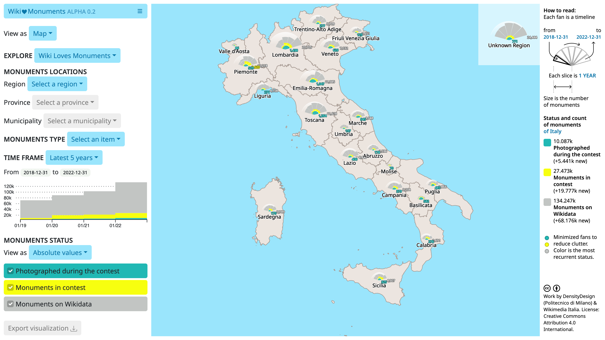

# Observatory for Italian Wiki Loves Monuments



The project is a data-driven observatory for the Italian Wiki Loves Monument contest. Its goal it to show how many monuments (cultural properties) have been photographed, at least once, by the community of Wikimedia. Additionally it can show how many of them we can find on Wikidata and the portion that is participating into the contest.

### Installation

In case required, add the `basePath` property to the `next.config.js` file (more info [here](https://nextjs.org/docs/api-reference/next.config.js/basepath))
Then:

```
# Install dependencies
npm i

# Run development server
npm run dev

# Local build
npm run export
```

### Development and Deployment

Please use the branch `dev` for developing purpose and merge into `main` only what you want to become public.
The repository uses GitHub Actions to automatically deploy at every push on the `main` branch.
